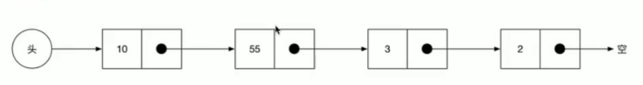
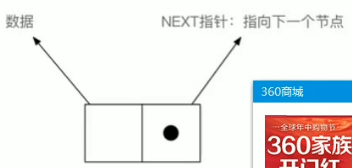
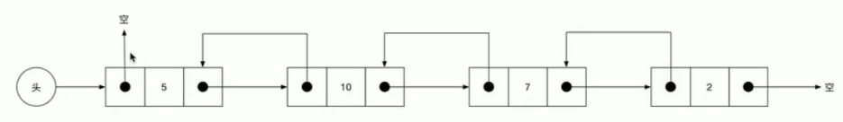
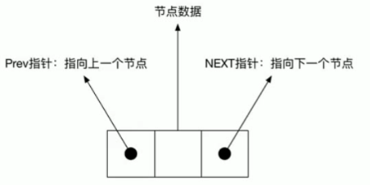
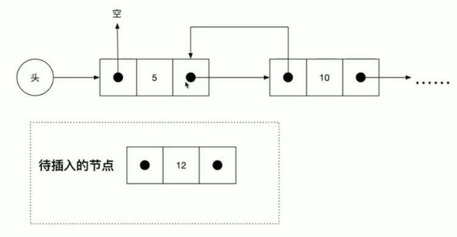
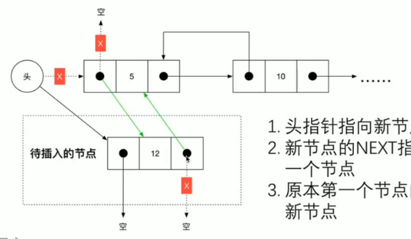
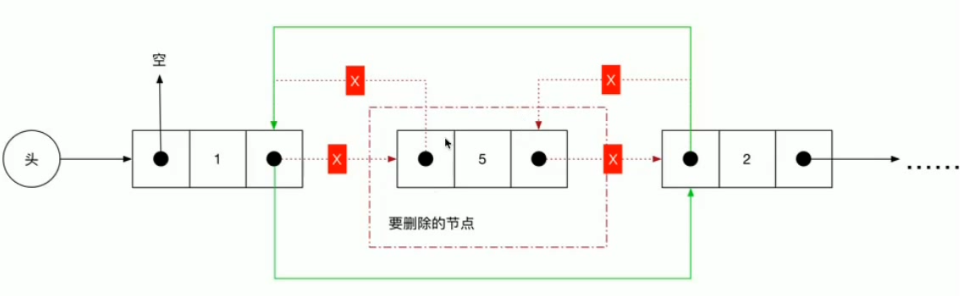

## 单项链表




- 链表是一个线性结构，但其中元素的数据可以存放在内存中的任何地方。因为链表中每一个元素除了存储数据结构外，还存储指向下一个节点的指针。


- 一个链表的节点相当于内存中的一个很小的连续空间。比如图中链表的第一个节点占用了内存地址 2012-2016。他的 next 指针指向了内存地址 2032.

### 双向链表




- 双向链表每个节点都有两个指针，一个指向上一个节点，另一个指向下一个节点。

### 循环链表

- 循环链表最后没有指向空指向头部，可以实现一个轮播图

### 链表操作图示

- 插入
  
  

- 头部指针指向新节点
- 新节点的 next 指针指向原节点的第一个节点
- 原本第一个节点的 prev 指针指向新节点

* 删除
  

### 时间复杂度

#### 链表

- 插入 O(1)
- 删除 O(1)
- 遍历、搜索 O(n)
-

```
/*
*将一个节点插入在头指针后面
*/
insert(node){
    node.next=this.head
    if(this.head){
        this.head.prev=node
        this.head=node
    }
}
```

### 用链表管理内存

- 在连续空间内构件一个链表，每个节点占用
  固定个数的内存空间（比如 3 个）。需要一个 free
  链表去管理没有分配的内存。
